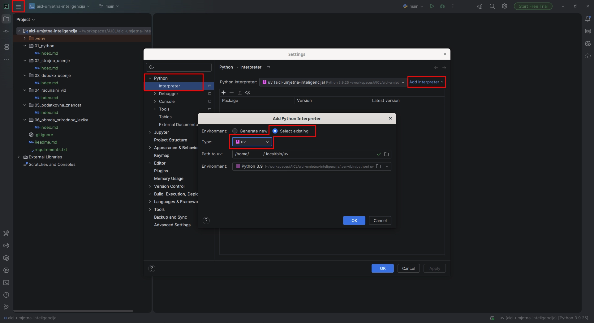

# AI Centar Lipik - Stručnjak/inja za umjetnu inteligenciju

Ovaj program je osmišljen kako bi polaznike osposobio za samostalnu izradu vlastitih programskih rješenja koristeći programski jezik Python, prikupljanje i obradu podataka, implementiranje algoritama strojnog učenja, dizajniranje vlastite neuronske mreže, razvijanje rješenja baziranih na različitim arhitekturama dubinskog učenja u područjima računalnog vida i obrade prirodnog jezika.

#### Znanja, vještine i sposobnosti koje se stječu programom
Savladati sve bitne koncepte programskog jezika Python, razumjeti pojmove i koncepte strojnog učenja, definirati i opisati temeljne koncepte neuronskih mreža, definirati način funkcioniranja algoritama dubinskog učenja, primijeniti odabranu arhitekturu dubinskog učenja za pojedini problem, analizirati programska rješenja zasnovana na algoritmima obrade slike i računalnog vida, savladati postupke pripreme podataka, razumjeti pojmove i primijeniti koncepte obrade prirodnog jezika.
#### Nastavni program
- Programiranje u programskom jeziku Python
- Strojno učenje
- Duboko učenje
- Računalni vid
- Uvod u podatkovnu znanost
- Obrada prirodnog jezika

## Repozitorij

Repozitorij sadrži stukturu za lakši početak i organizaciju nastavnih materijala, ali nije obavezan za praćenje programa niti sadrži edukacijske materijale i primjere. 

### Preporuke alata

- [uv](https://docs.astral.sh/uv/getting-started/installation/) - alat za upravljanje virtualnim okruženjima i paketima u Pythonu, koji pojednostavljuje instalaciju i održavanje ovisnosti projekta.
- [PyCharm](https://www.jetbrains.com/pycharm/) - integrirano razvojno okruženje (IDE) koje pruža napredne alate za razvoj u Pythonu, uključujući podršku za virtualna okruženja, upravljanje paketima i integraciju s verzionim sustavima poput Git-a.

Upute u nastavku pisane su uz pretpostavku da imate instalirana oba alata.

### Instalacija virtualnog okruženja
Virtualno okruženje je izolirani dio sustava koji sadrži sve potrebne biblioteke za rad. Više o virtualizaciji te usporedbi virtualnih strojeva, kontejnera i virtualnih okruženja možete vidjeti u dokumentu [Virtualizacija](docs/Virtualizacija.pdf).
```bash
uv venv --python 3.9 --clear
```
Primjer koristi Python 3.9 jer su neke biblioteke koje se koriste u projektu kompatibilne samo s određenim verzijama Pythona. Ukoliko koristite noviju verziju Pythona, moguće je da će neke biblioteke imati problema s kompatibilnošću, stoga se preporučuje korištenje Python 3.9 verzije.

### Aktivacija virtualnog okruženja
Aktivacija virtualnog okruženja ovisi o operativnom sustavu koji koristite:
- Na Windowsu:
```cmd
.venv\Scripts\activate
```
- Na Unix/Linux/MacOS:
```bash
source .venv/bin/activate
```
Ukoliko koristite PyCharm, virtualno okruženje možete postaviti u postavkama projekta, gdje ćete odabrati `.venv` direktorij kao Python interpreter. Virtualno okruženje će biti aktivirano automatski kada otvorite projekt u PyCharmu ili pokrenete terminal unutar PyCharma.

### Instalacija biblioteka
Sve potrebne biblioteke navedene su u datoteci requirements.txt te ćemo sve instalirati koristeći:
```bash
uv pip install -r requirements.txt
```
### Postavke integriranog razvojnog okruženja (IDE)
Za potrebe edukacije, koristiti će se programsko okruženje PyCharm. Potrebno je postaviti virtualno okruženje unutar PyCharma kako bi se osigurala kompatibilnost s projektom. Nakon što ste kreirali virtualno okruženje, slijedite ove korake:
1. Otvorite PyCharm i učitajte projekt.
2. Idite na `File > Settings > Python > Interpreter`.
3. Kliknite na padajući izbornik `Add Interpreter`.
4. Odaberite `Add Local Interpreter`.
5. Odaberite `Select Existing` i odaberite `uv` iz padajućeg izbornika.
6. Putanja do virtualnog okruženja će biti automatski prepoznata, ali ako nije, ručno odaberite `.venv` direktorij unutar vašeg projekta.
7. Kliknite `OK` i zatim `Apply` da biste spremili postavke.



PyCharm će sada koristiti virtualno okruženje za sve operacije unutar projekta, uključujući pokretanje skripti, instalaciju paketa i upravljanje ovisnostima.

### Pregled nastavnih materijala

Pregled nastavnih materijala moguće je vidjeti pomoću [Jupyter Book](https://jupyterbook.org/) koji je već konfiguriran u repozitoriju. Nakon što ste postavili virtualno okruženje i instalirali sve potrebne biblioteke, pokrenite sljedeću naredbu u terminalu:
```bash
jupyter book start
```

Zatim otvorite preglednik i idite na `http://localhost:3000/` gdje ćete moći pregledavati sve nastavne materijale organizirane po temama. Nakon što dodate nove materijale u repozitorij, oni će automatski biti dostupni u pregledniku.

### Ažuriranje i ispravci
Ako primijetite bilo kakve greške ili imate prijedloge za poboljšanje nastavnih materijala, molim da otvorite [issue](https://github.com/daspicko/aicl-umjetna-inteligencija/issues) ili [pull request](https://github.com/daspicko/aicl-umjetna-inteligencija/pulls) na [GitHub repozitoriju](https://github.com/daspicko/aicl-umjetna-inteligencija).
